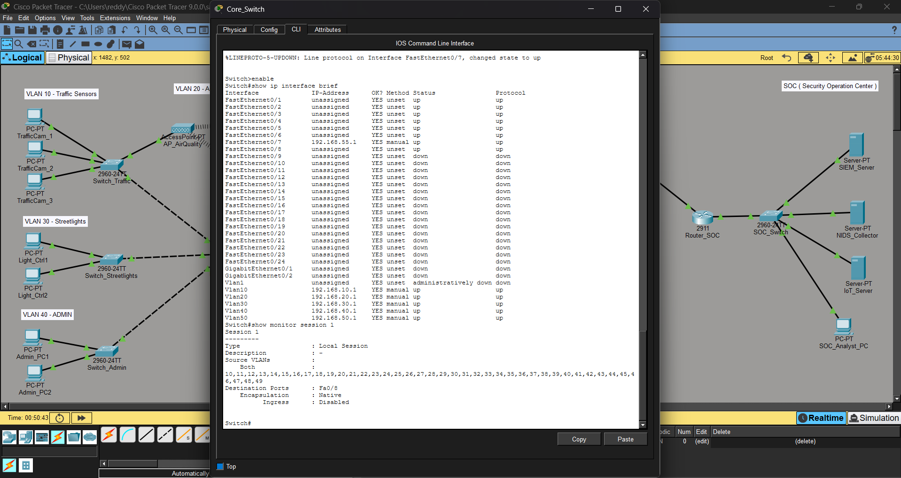

# MetroSense — Smart City IoT Network with Layered Intrusion Detection

A Cisco Packet Tracer project simulating a segmented smart-city IoT network protected by a layered Network Intrusion Detection System (NIDS), reporting to a remote Security Operations Centre (SOC).

## Motive

Modern smart cities and hospitals deploy large numbers of low-security IoT devices (cameras, sensors, controllers) that are common attack entry points. This project demonstrates how proper network segmentation and layered monitoring contain a compromised device's blast radius and get an attack detected early — instead of letting it spread across the network, cause disruption, and go unnoticed.

## Architecture

**City side:**
- 4 segmented VLANs by device class — Traffic Sensors, Air Quality (wireless), Streetlights, Admin
- Distribution + Core (Layer 3) switching layer with inter-VLAN routing
- 3-point NIDS deployment: Core, Firewall, and Edge — each catching a different stage of an attack
- ASA 5505 firewall enforcing security-level policy between internal and external zones

**WAN link:**
- Routed site-to-site connection to a remote SOC over a simulated public-style transit subnet

**SOC side:**
- NIDS Collector aggregating city-side sensor data
- SIEM server for event correlation
- Analyst workstation

## Key Design Decisions

- **Static IP addressing** on all IoT/infrastructure devices rather than DHCP — removes rogue-DHCP as an attack vector for sensor-class devices.
- **SPAN (port mirroring)** for passive, out-of-band traffic inspection — no inline latency, no single point of failure.
- **Native wireless IoT devices** (not laptops with wireless modules) for the Air Quality VLAN, after discovering Packet Tracer's desktop-only wireless NIC module doesn't support laptop hardware.

## Full IP Addressing

See [`MetroSense_Build_Manual.pdf`](./MetroSense_Build_Manual.pdf) for the complete addressing plan (10 subnets), device inventory, and full CLI configuration for every switch, router, and firewall.

## Issues Encountered & Resolved

This build surfaced a number of genuine platform constraints, documented in full in the build manual:

| Issue | Resolution |
|---|---|
| ASA 5505 Base license rejected a 3rd active interface | Relocated the affected NIDS sensor to the core server segment |
| Fresh ASA silently held factory-default interface names on unused VLANs | Explicitly cleared `nameif` on Vlan1/Vlan2 before reassigning to the VLANs actually in use |
| `icmp permit` (real ASA command) unsupported in Packet Tracer | Achieved the same effect with an access-list applied inbound on both interfaces |
| Cloud-PT object passed 0% of traffic despite correct routing on both sides | Replaced with a plain switch — issue isolated to the transit device, not endpoint config |
| 3560 switches rejected `trunk` mode without explicit encapsulation | Set `switchport trunk encapsulation dot1q` before trunk mode |

Full troubleshooting narrative — including root cause analysis for each — is in Section 9 of the build manual.

## Files in this repo

- `MetroSense_Build_Manual.docx` — full build manual: device inventory, IP addressing, step-by-step CLI configuration, verification steps, and issues/resolutions
- `MetroSense-Smart-City-NIDS-Network-PacketTracer.pkt` — the Packet Tracer project file
- `topology.png` — full network topology
- `core-switch-verification.png` — CLI proof of VLAN routing and active SPAN session

## IoT Device Status Dashboard

In addition to the security/NIDS monitoring pipeline, an **IoT Server** was added to the SOC segment to demonstrate device-level status reporting — separate from, and complementary to, the intrusion detection system.

- Wireless IoT sensors (Smoke Detector, Motion Detector) register to the IoT Server and report live status
- Viewed via a web dashboard from the SOC Analyst PC
- This represents device telemetry/health visibility, distinct from the SPAN-based security monitoring described above

## Verification

Full end-to-end connectivity was verified from every city-side VLAN through to the SOC, including:
- Local VLAN gateway reachability
- Inter-VLAN routing through the core
- Traffic passing correctly through the firewall (with ICMP inspection)
- WAN link connectivity to the remote SOC
- Active SPAN session confirmed via `show monitor session 1`

All five VLAN SVIs (10/20/30/40/50) are up with correct IP addressing, and the SPAN session is confirmed actively mirroring VLANs 10-50 to the NIDS sensor on Fa0/8.

## Tech / Concepts Used

Cisco IOS · VLANs & Inter-VLAN Routing · ASA Firewall (Security Levels, ACLs, NAT-free routed mode) · SPAN/Port Mirroring · Static Routing · Wireless (WPA2) · WAN/Site-to-Site Connectivity · Network Segmentation for IoT Security
